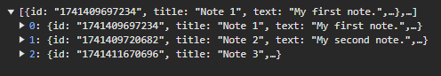
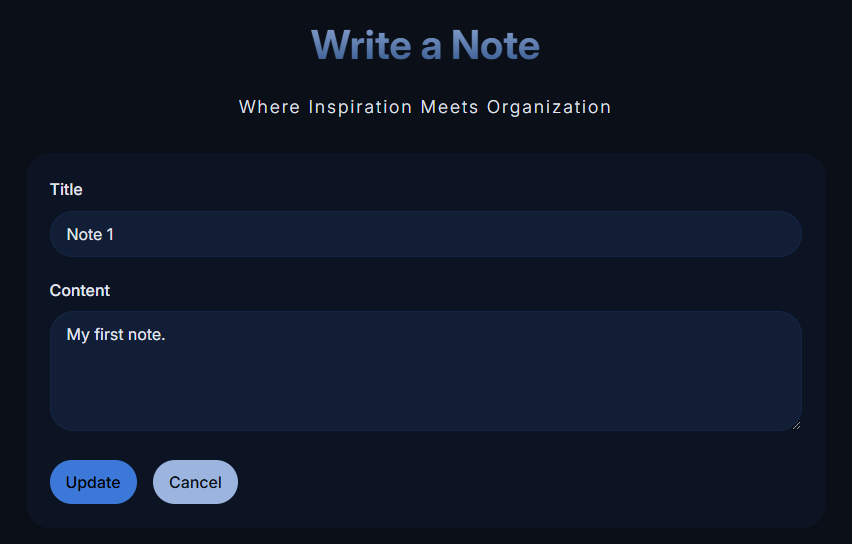
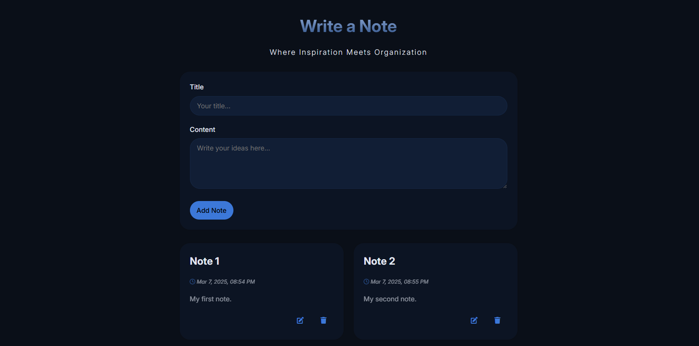
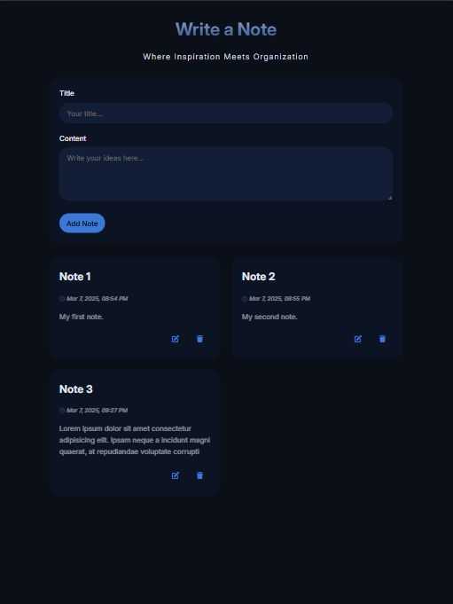
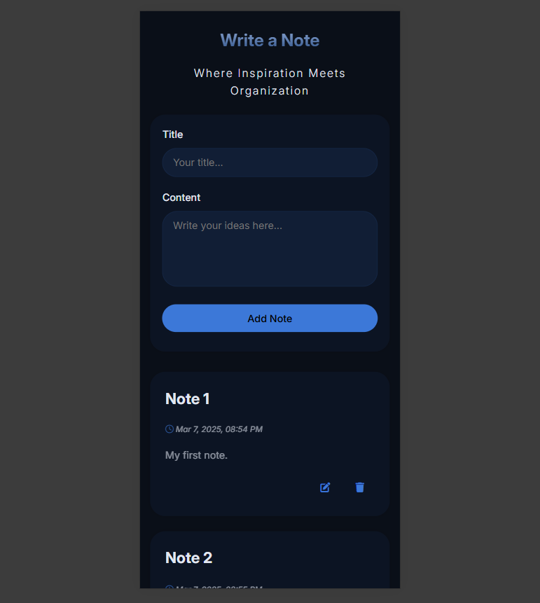

# WD-PRAC-6
Notes app using local storage to save data.

## Description
The goal of this practice was to create a notes app that provides users with a simple and intuitive user interface for creating, editing and deleting notes. The website stores the notes in the browser's local memory, ensuring that they remain saved even after closing and refreshing the browser.

## HTML Structure
- A header section with the title and slogan.
- A form for adding new notes, including input fields for the note title and content.
- A container to display the list of notes.
- Links to the CSS stylesheet and Font Awesome for icons.

## CSS Structure
- Variables for colors, fonts, and other design elements.
- General styles for the body and text.
- Specific styles for the header, note container, input fields, buttons, and notes.
- Responsive design adjustments for different screen sizes.

## Java Structure
- Loading notes from local storage when the page loads.
- Rendering notes in the container.
- Adding, editing, and deleting notes.
- Saving notes to local storage.

## Images
- Local Storage:

- Editing note

- Desktop:

- Tablet:

- Phone:

## Links
**Github:**

- [GitHub Repository](https://github.com/faiyamm/WD-PRAC-6)